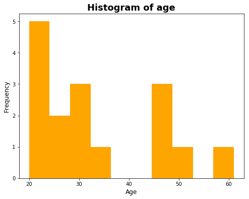

## Introduction
The objective of this guide is to create basic visualizations using the `Python` fundamental visualization library, `Matplotlib`.

Matplotlib is helpful to generate publition quality figures with just a few lines of code. The `pyplot` module inside Matplotlib provides all the necessary functions to implement the basic visualizations. In the successive series of Matplotlib guide, we will learn about how to have the full control over the figure properties.

In this guide, we are going to learn about the implementation of the following figures:
1. Histogram 
2. Scatter plot 
3. Bar chart 
4. Pie chart 
5. Boxplot

## The Baseline
Before we begin using the functions available in `pyplot` module, let us know how to import it and what alias to use.

**Syntax:**

```python
# Importing NumPy (used to pass input data)
import numpy as np

# Importing Matplotlib
import matplotlib.pyplot as plt
```

So, we will be referencing `matplotlib.pyplot` with its alias `plt` throughout this guide.

## Building a Histogram
As per Merriam-Webster dictionary, a histogram is defined as:

> A representation of a frequency distribution by means of rectangles whose widths represent class intervals and whose areas are proportional to the corresponding frequencies.

To build a histogram in matplotlib, let us take input as an age sample stored in a `NumPy` array and plot it:


```python
# Initializing age variable
age = np.array([20, 20, 21, 22, 24, 26, 28, 29, 29, 30, 35, 45, 45, 48, 50, 61])

# Defining the figure size
plt.figure(figsize=(8, 6))

# Building histogram on age variable
plt.hist(age, color='Orange')

# Mentioning the title
plt.title('Histogram of age', weight='bold', fontsize=18)

# Mentioning the x and y labels
plt.xlabel('Age', fontsize=12)
plt.ylabel('Frequency', fontsize=12)

# Displaying the output
plt.show()
```



## Building a Scatter Plot
As per Merriam-Webster dictionary, a scatter plot is defined as:

> A two-dimensional graph in rectangular coordinates consisting of points whose coordinates represent values of two variables under study.

To build a scatter plot in Matplotlib, let's consider two variables; age, and salary of 15 professionals and plot them against each other as shown:


```python
# Initializing age and salary of 15 professionals
age = np.array([20, 20, 21, 22, 24, 
                26, 28, 29, 29, 30, 
                35, 45, 45, 48, 50])
salary = np.array([55000, 35000, 25000, 65000, 38000, 
                   94000, 78000, 12000, 85000, 50000, 
                   99000, 66000, 32000, 12000, 94000])

# Defining the figure size
plt.figure(figsize=(8, 5))

# Building scatter plot between both the variables
plt.scatter(age, salary, s=100, color='Orange') # s: Size of circles

# Mentioning the title
plt.title('Scatter plot between Age and Salary \n of 15 professionals', weight='bold', fontsize=18)

# Mentioning the x and y labels
plt.xlabel('Age', fontsize=12)
plt.ylabel('Salary', fontsize=12)

# Displaying the output
plt.show()
```


## Building a Bar Chart
As per Merriam-Webster dictionary, a bar chart is defined as:

> A graphic means of quantitative comparison by rectangles with lengths proportional to the measure of the data or things being compared.

To visualize a simple bar chart in Matplotlib, let us consider the number of employees in each department of a company. Consider there are five departments and the count of employees in each department is represented through the given table:

| **Department** | **Employees count** | 
| --- | --- |
| Technology | 500 |
| HR | 200 |
| Finance | 150 |
| Marketing | 600 |
| Sales | 250 |

Let us visualize this data using bar chart as shown:


```python
# Initializing department and employees_count variables
department = np.array(['Technology', 'HR', 'Finance', 'Marketing', 'Sales'])
employees_count = np.array([500, 200, 150, 600, 250])

# Defining the figure size
plt.figure(figsize=(8, 5))

# Defining bar width and number of categories
bar_width = 0.5
categories = np.arange(len(department))

# Building bar chart between both the variables
plt.bar(categories, employees_count, bar_width, color='Orange')

# Mentioning the title
plt.title('Bar Chart displaying \n employees per department', weight='bold', fontsize=18)

# Mentioning the x and y labels
plt.xlabel('Department', fontsize=12)
plt.ylabel('Employees count', fontsize=12)

# Replacing x-ticks with department names
plt.xticks(categories, department)

# Displaying the output
plt.show()
```


## Building a Pie Chart
As per Merriam-Webster dictionary, a pie chart is defined as:

> A circular chart cut by radii into segments illustrating relative magnitudes or frequencies.

To build a pie chart in Matplotlib, let us consider the relative percentage temperature with respect to 100 degree celsius in each of the four seasons of a region as shown below:

| **Season** | **Relative Temperature Percentage** |
| --- | --- |
| Summer | 45 |
| Autumn | 15 |
| Spring | 30 |
| Winter | 10 |

Let us plot this data on a pie chart as shown:


```python
# Initializing season and percentage variables
season = np.array(['Summer', 'Autumn', 'Spring', 'Winter'])
percentage = np.array([45, 15, 30, 10])

# Defining the figure size
plt.figure(figsize=(8, 5))

# Bringing out Winter season (optional)
explode = (0, 0, 0, 0.3)  

# Setting the colors
colors = ['gold', 'lightcoral', 'yellowgreen', 'lightskyblue']

# Building the pie chart
plt.pie(percentage, explode=explode,
       labels=season, colors=colors,
       autopct='%.2f%%',   # display percentage value
       shadow=True,
       startangle=0)

# Setting the aspect ratio -> equal 
# to make the resultant pie circular.
plt.axis('equal')

# Mentioning the title
plt.title('Pie Chart displaying temperature \n percentage per season', weight='bold', fontsize=18)

# Displaying the output
plt.show()
```


## Building a Boxplot
As per Wikipedia, a boxplot is defined as:

> A method for graphically depicting groups of numerical data through their quartiles.

As the definition suggests, a boxplot helps us to plot a numerical data at 25th, 50th (also represents the median) and 75th quartiles. It also provides the minimum and maximum values along with positive and negative outliers in the data.

Let us build a boxplot in Matplotlib using a sample age data as shown:


```python
# Initializing the age variable
age = np.array([-50, 20, 50, 23, 34, 52, 42, 25, 
                           26, 33, 38, 42, 48, 80, 90, 100])

# Setting the figure size
plt.figure(figsize=(5, 6))

# Building boxplot
plt.boxplot(age)

# Mentioning the title
plt.title('Boxplot of Age', weight='bold', fontsize=18)

# Hiding the xtick: 1
plt.xticks([])

# Labelling the y-axis
plt.ylabel('Age', fontsize=12)

# Displaying the output
plt.show()
```


As can be observed from the figure, there are three outliers in the data (-8, 90, 100) represented by circles. The median line (orange color) represents the 50th percentile as equals to age 40.

## Conclusion
In this guide, you have learned plotting various basic visualizations using Matplotlib. You have also learned about mentioning the X and Y labels along with the figure title, controlling the figure size, replacing the X-ticks and finally displaying the figure.
